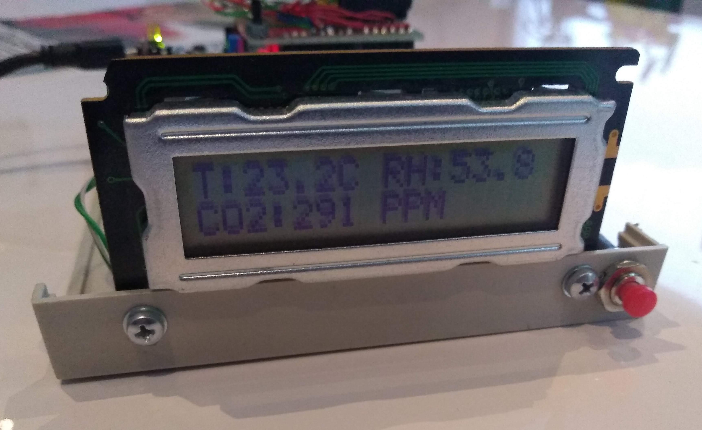
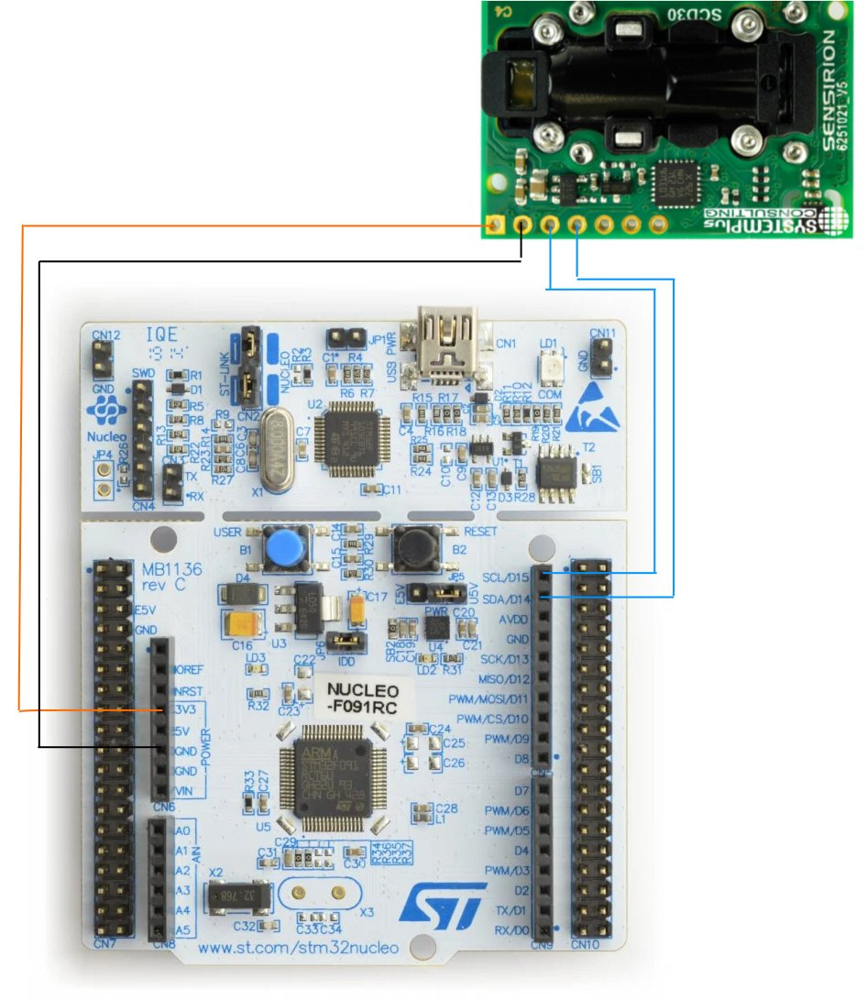

# Getting started with Air Quality Meter on Mbed OS

This guide reviews the steps required to get samples from the Air Quality Sensor on Mbed OS platform.
The device features:

- mbed-os
- STM32 Nucleo F091RC board
- DHT22 temperature and humidity sensor
- Sensirion SCD30 CO2 sensor
- 16x2 LCD

Please install [mbed CLI](https://github.com/ARMmbed/mbed-cli#installing-mbed-cli).



## Import the example application

From the command-line, import the example:

```bash
$ mbed import git@github.com:geoffrey-vl/mbed-air-quality-meter.git
$ cd mbed-air-quality-meter
```

### Now compile

Invoke `mbed compile`, and specify the name of your platform and your favorite toolchain (`GCC_ARM`, `ARM`, `IAR`). For example, for the GCC compiler:

```bash
$ mbed compile -m NUCLEO_F091RC -t GCC_ARM --profile=release
```

Your PC may take a few minutes to compile your code. At the end, you'll see the following result:

```bash
[Warning] @,: Compiler version mismatch: Have 9.2.1; expected version >= 6.0.0 and < 7.0.0
Building project mbed-air-quality-meter (NUCLEO_F091RC, GCC_ARM)
Scan: mbed-air-quality-meter
Link: mbed-air-quality-meter
Elf2Bin: mbed-air-quality-meter
| Module             |     .text |    .data |     .bss |
|--------------------|-----------|----------|----------|
| DHT.o              |   670(+0) |    0(+0) |    0(+0) |
| TextLCD/TextLCD.o  |  4284(+0) |    0(+0) |    0(+0) |
| [fill]             |    84(+0) |    8(+0) |   30(+0) |
| [lib]/c.a          | 31752(+0) | 2472(+0) |   89(+0) |
| [lib]/gcc.a        | 15664(+0) |    0(+0) |    0(+0) |
| [lib]/misc         |   192(+0) |    4(+0) |   28(+0) |
| [lib]/nosys.a      |    32(+0) |    0(+0) |    0(+0) |
| [lib]/stdc++.a     |  6200(+0) |    8(+0) |   44(+0) |
| main.o             |  1988(+0) |    0(+0) |  714(+0) |
| mbed-os/drivers    |  1718(+0) |    0(+0) |   44(+0) |
| mbed-os/hal        |  1324(+0) |    4(+0) |   66(+0) |
| mbed-os/platform   |  4928(+0) |  276(+0) |  480(+0) |
| mbed-os/rtos       |  6672(+0) |  168(+0) | 5969(+0) |
| mbed-os/targets    | 12944(+0) |    4(+0) | 1120(+0) |
| mbed-scd30/scd30.o |   900(+0) |    0(+0) |    0(+0) |
| Subtotals          | 89352(+0) | 2944(+0) | 8584(+0) |
Total Static RAM memory (data + bss): 11528(+0) bytes
Total Flash memory (text + data): 92296(+0) bytes

Image: ./BUILD/NUCLEO_F091RC/GCC_ARM-RELEASE/mbed-air-quality-meter.bin
```

### Wirings




### Program your board

1. Connect your Mbed device to the computer over USB.
2. Copy the binary file to the Mbed device.
    ```
    $ cp BUILD/NUCLEO_F091RC/GCC_ARM-RELEASE/mbed-air-quality-meter.bin /media/geoffrey/NODE_F091RC
    ```
3. Press the reset button to start the program.

### Program output

```bash
$ minicom -b 115200 -D /dev/ttyACM3
21.5;45.3;361.3
21.5;45.3;361.3
21.8;45.4;361.3
22.6;45.4;361.3
23.7;45.3;361.3
```

### Logging to a .csv file

We can automate logging to a CSV file, and for example also add some other values such as CPU temperature.
Include is a example script written in python that does exactly that, and takes samples each 5 minutes.
Use the `usbtemp.py` script added to this repo, and copy it over to your target system:
Make sure the target has **python 3** and that you have the *pyserial* library installed:

```bash
$ pip3 install pyserial
```

Execute the python script:

```bash
$ python3 usbtemp.py /deb/ttyACM3
Press Ctrl+C to quit
Collecting data... (USB =  /dev/ttyACM0 )
Creating log file:  temp.csv
Log:  2020-06-17 11:35:24,24.3,48.0
Zzz...
Collecting data... (USB =  /dev/ttyACM0 )
Log:  2020-06-17 11:35:34,24.3,48.0
Zzz...
```

To stop the python script from executing: press `ctrl+c`.
On the target, in the folder where you executed the script, a CSV file is generated.

File content:

```csv
TIMESTAMP,DHT22,CPU
2020-06-17 11:35:24,24.3,48.0
2020-06-17 11:35:34,24.3,48.0
2020-06-17 11:35:44,24.3,48.0
```

Unortunaltey is you disconnect over SSH the python child process is terminated too.
If you want to keep the python script running (as a background process) after you've exited your SSH session you should use `nohup`:

```bash
$ nohup python3 usbtemp.py /deb/ttyACM3 &
```

### License and contributions

The software is provided under Apache-2.0 license. Contributions to this project are accepted under the same license.

This project contains code from other projects. The original license text is included in those source files. They must comply with our license guide.
